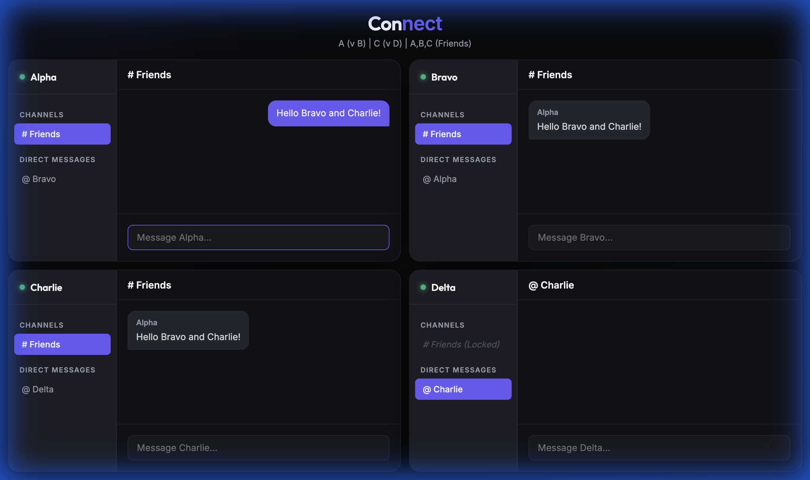

# Connect | Real-time Messenger APP

**Connect** is a premium, multi-user WebSocket demonstration featuring a high-concurrency "Matrix View". It simulates 4 independent users in a single dashboard, showing complex room isolation, private messaging, and sidebar-based navigation.



## 🚀 Key Features

- **Matrix Dashboard**: View 4 concurrent active users (Alpha, Bravo, Charlie, Delta) interacting in real-time on one screen.
- **Smart Room Isolation**:
  - `# Friends` Channel: Shared space for Alpha, Bravo, and Charlie.
  - `@ Direct Messages`: Private 1-on-1 channels (e.g., A ↔ B, C ↔ D) with strict cryptographic-like isolation.
- **Sidebar-Based UI**: A sleek left-sidebar navigation for each user to switch between public channels and private DMs.
- **Access Control**: Dynamic membership logic (e.g., Delta is restricted from the `# Friends` channel).
- **Glassmorphism Design**: High-end dark mode aesthetics with blur effects, gradients, and micro-animations.

## 🛠️ Tech Stack

- **Backend**: Python 3.14+, FastAPI, WebSockets (`json` protocol).
- **Frontend**: HTML5, Vanilla CSS (Modern Grid/Flexbox), JavaScript (ES6+).
- **Orchestration**: Docker & Docker Compose for instant deployment.

## 🏃 Running Locally

### Option 1: Docker (Recommended) 🐳
The fastest way to spin up the matrix:
```bash
docker compose up --build
```
Access the dashboard at [http://localhost:8001](http://localhost:8001)

### Option 2: Python Native
1. Initialize environment:
   ```bash
   python3 -m venv venv
   source venv/bin/activate
   pip install -r requirements.txt
   ```
2. Run the server:
   ```bash
   uvicorn main:app --reload --host 0.0.0.0 --port 8001
   ```

## 📂 Project Structure
- `main.py`: The heart of the app—manages room logic and multi-user broadcasting.
- `static/index.html`: The 4-user Matrix layout.
- `static/script.js`: Client-side routing for multi-subscriptions.
- `static/style.css`: Premium dark mode styling and sidebar layout.
